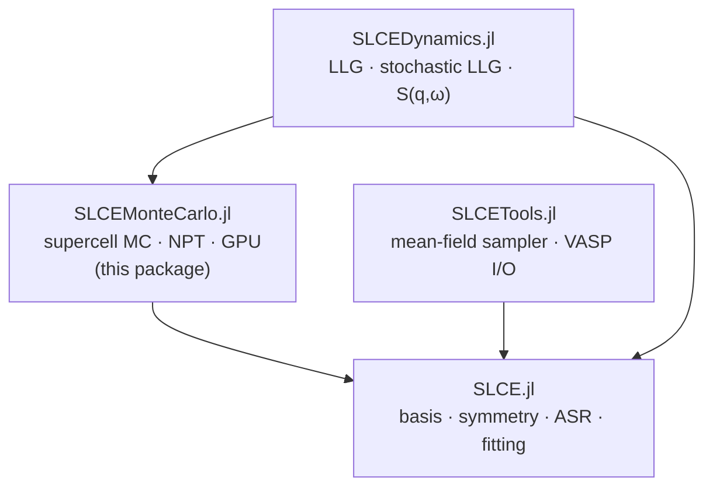
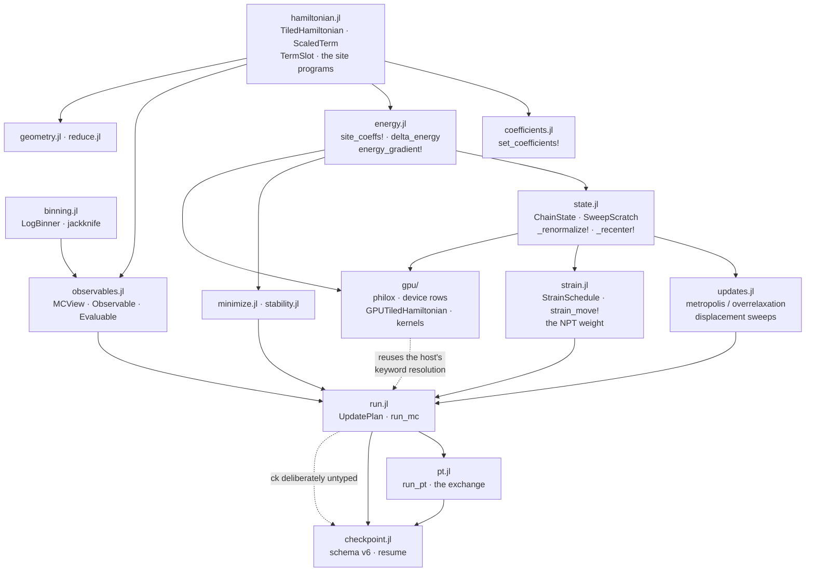

# Architecture and reading order — SLCEMonteCarlo.jl

This file answers one question: **coming back to this code, what do I read, in what
order, and how do the pieces depend on each other?**

Neighbours that cover the rest, and are not duplicated here:

| For | Read |
|---|---|
| What the public API *is* (types, functions, per-file layout) | [`SPEC.md`](SPEC.md) |
| Which files must change together, and the gate that proves it | [`CLAUDE.md`](CLAUDE.md) § index → [`docs/specs/coupled-sites.md`](docs/specs/coupled-sites.md) |
| Why a decision was made (tiling, stationarity, PT determinism, the strain move, checkpoint schema, GPU) | [`docs/specs/`](docs/specs/) |
| Naming | [`STYLE_GUIDE.md`](STYLE_GUIDE.md) |
| The family-wide data flow | [`../SLCE.jl/ARCHITECTURE.md`](../SLCE.jl/ARCHITECTURE.md) § 5 |

---

## 1. Where this package sits



An arrow **A → B** reads "A depends on B".

**What this package reads from SLCE** — and it is the *whole* contract; nothing else
is permitted, in particular never `model.basis.crystal` or any SALC-basis internal:

`decorated_terms` · `spin_multipole_terms` · `row_layout` / `row_index` / `site_rows!` ·
`restrict` · `n_atoms(model)` · `intercept` · `SLCE.load(SLCEModel, …)` ·
`Lattice` / `Crystal` / `cartesian_positions` · `SLCE.Harmonics` · `SLCE.SolidHarmonics` ·
`KB_EV` / `resolve_kt` (borrowed, never re-defined).

**What this package provides upward**, to SLCEDynamics: `TiledHamiltonian`,
`energy_gradient!`, `MCView` / `Observable` / `Evaluable`, `LogBinner` and the
jackknife, `philox_*`, `model_fingerprint`, `resume`.

**Third-party dependencies**: `JLD2` (checkpoint schema v6), `KernelAbstractions` +
`Adapt` (the GPU sweep and gradient kernels — **no CUDA dependency**; the kernels are
backend-generic), plus StaticArrays / LinearAlgebra / Statistics / Random / Printf.

---

## 2. Internal layering

Include order in `src/SLCEMonteCarlo.jl`:

```
units.jl · hamiltonian.jl · coefficients.jl · energy.jl · binning.jl · observables.jl
state.jl · strain.jl · updates.jl
gpu/{philox, zlm_device, disp_device, grad_device}.jl
gpu/{gpu_hamiltonian, gpu_state, gpu_sweep, gpu_gradient}.jl
minimize.jl · stability.jl · run.jl · pt.jl · checkpoint.jl · geometry.jl · reduce.jl
```



### Include positions that are load-bearing

- `hamiltonian.jl` first — its types appear in nearly every signature downstream.
- `binning.jl` before `observables.jl` — `ObsAccumulator` has `LogBinner` fields.
- `state.jl` before `strain.jl` and `updates.jl` — both annotate `::ChainState`.
- `observables.jl` and `strain.jl` before `run.jl` — `run_mc`'s signature annotates both.
- `run.jl` before `pt.jl` — `_PTLane` holds an `UpdatePlan` and an `ObsAccumulator`.
- `checkpoint.jl` after both drivers — it annotates `Vector{_PTLane}`.
- inside `gpu/`: `gpu_hamiltonian.jl` → `gpu_state.jl` → `gpu_sweep.jl`.

### The two upward calls, both intentional

1. `gpu/gpu_sweep.jl` calls `_resolve_disp_passes` and `_escape_min_checks` from
   `run.jl`, which is included *later*. Deliberate: the device driver reuses the
   host's keyword resolution so that the two paths cannot disagree about what a
   keyword means or which warning fires.
2. `run.jl` and `pt.jl` call the checkpoint writers, which are included later. Sound
   only because the `ck` parameter is left **deliberately untyped** in every driver
   signature — annotate it and the package stops loading.

---

## 3. Reading order

About two hours. It assumes SLCE.jl's reading order has been done, at least through
its introspection surface.

| # | File | What it establishes | Key names |
|---|---|---|---|
| 1 | `src/SLCEMonteCarlo.jl` | The design statement: the SLCE surface consumed, the `(4π)` scale applied exactly once, the temperature-keyword policy, the reproducibility scope | the `using`/`import` block *is* the dependency contract |
| 2 | `src/hamiltonian.jl` | The entire static model — tiling, the contraction programs, the colouring. Read the type and its constructors first; the program builder can wait | `TiledHamiltonian`, `ScaledTerm`, `TermSlot`, `SpinConfig` |
| 3 | `src/energy.jl` | The one arithmetic contract of the package. The `_ref` kernels are the readable specification of the fast path | `site_coeffs!`, `delta_energy`, `energy_gradient!` |
| 4 | `src/state.jl` | What a chain *is*, and the two gauge operations | `ChainState`, `SweepScratch`, `_renormalize!`, `_recenter!` |
| 5 | `src/updates.jl` | The three moves, and the colour-ordered scan that makes a parallel sweep bitwise equal to a serial one | `metropolis_sweep!`, `overrelaxation_sweep!`, `displacement_sweep!` |
| 6 | `src/observables.jl` | The measurement seam — one argument, so a new channel does not break every observable ever written | `MCView`, `Observable`, `Evaluable`, `_finalize_stats` |
| 7 | `src/run.jl` | The canonical driver: pass scheduling, adaptation, measurement cadence, checkpoint cadence | `UpdatePlan`, `_compound_sweep!`, `run_mc` |
| 8 | `src/pt.jl` | One chain becomes R lanes: what a swap moves, and the RNG discipline that keeps it thread-count-independent | `_PTLane`, `_lane_segment!`, `_swap_lanes!`, `run_pt` |
| 9 | `src/strain.jl` | The NPT tier, layered *on top of* the fixed-cell one rather than woven into it | `StrainSchedule`, `strain_move!`, `strain_delta_energy`, `npt_observables` |
| 10 | `src/minimize.jl` | The non-sampling entry points | `minimize_energy`, `find_ground_state` |

### Safe to skip on a first pass

- `src/gpu/philox.jl`, `zlm_device.jl`, `disp_device.jl`, `grad_device.jl` — **pure
  device mirrors** of CPU routines, existing because the upstream implementations
  carry runtime-string throws that cannot compile inside a kernel. They contain no
  design decision beyond "match the host bitwise".
- `src/gpu/gpu_hamiltonian.jl`, `gpu_state.jl` — mechanical upload glue.
- `src/checkpoint.jl` — JLD2 read/write pairs. You need the schema constant and
  `resume`; the rest is plumbing.
- `src/binning.jl` — textbook streaming log-binning plus a jackknife.
- `src/geometry.jl` — three converters.
- `src/reduce.jl` — an optional pre-processing step (`reduce_cell`), not on the main
  path.
- `src/stability.jl` — an offline screening tool no driver calls.

---

## 4. Entry points and where the work happens

```
TiledHamiltonian(model; dims)          hamiltonian.jl
 ├─ SLCE.row_layout
 ├─ pure-spin ctor    → SLCE.restrict + spin_multipole_terms
 ├─ joint ctor        → SLCE.decorated_terms
 └─ inner ctor
      ├─ _build_programs → _push_term_programs!     ← site + energy programs
      ├─ _color_sites                                ← instance-disjoint classes
      └─ _translation_residuals → _total_energy

run_mc                                 run.jl
 └─ _mc_loop! → _run_temperature! → _compound_sweep!
      ├─ metropolis_sweep!             updates.jl → _attempt_metro!
      │     └─ site_coeffs! → delta_energy          energy.jl
      ├─ overrelaxation_sweep! / displacement_sweep!
      ├─ strain_move!                  strain.jl   (only when a schedule is given)
      └─ _measure! → _finalize_stats → jackknife    observables.jl / binning.jl

run_pt                                 pt.jl
 └─ _pt_run! → _run_pt_phase! → _lane_segment! → _compound_sweep!
      └─ _boundary! → _attempt_swap! → _swap_lanes!

minimize_energy / find_ground_state    minimize.jl → _minimize! → _gradient!
                                                     → energy_gradient!  energy.jl
resume                                 checkpoint.jl → _read_chain → _mc_loop! / _pt_run!
reduce_cell                            reduce.jl
gpu_run_sweeps!                        gpu/gpu_sweep.jl → _metro_kernel!
gpu_energy_gradient!                   gpu/gpu_gradient.jl   ← the SLCEDynamics seam
```

Three things about this map are worth remembering rather than re-deriving:

- **`delta_energy` is exact for any body order** because every instance's member
  *sites* are distinct after the toroidal wrap, so the leave-one-out coefficient
  vector does not depend on the spin being moved. The constructor asserts it.
- **A parallel sweep is bitwise equal to a serial one**: sites in one colour class
  share no instance, each site owns an RNG stream, and the ΔE reduction happens in a
  fixed order.
- **The NPT volume power is `V^(n_disp_active)`** and appears at five sites that must
  agree — the schedule, the log weight, the `:pressure` evaluable, the pairing check,
  and the grid fingerprint.
